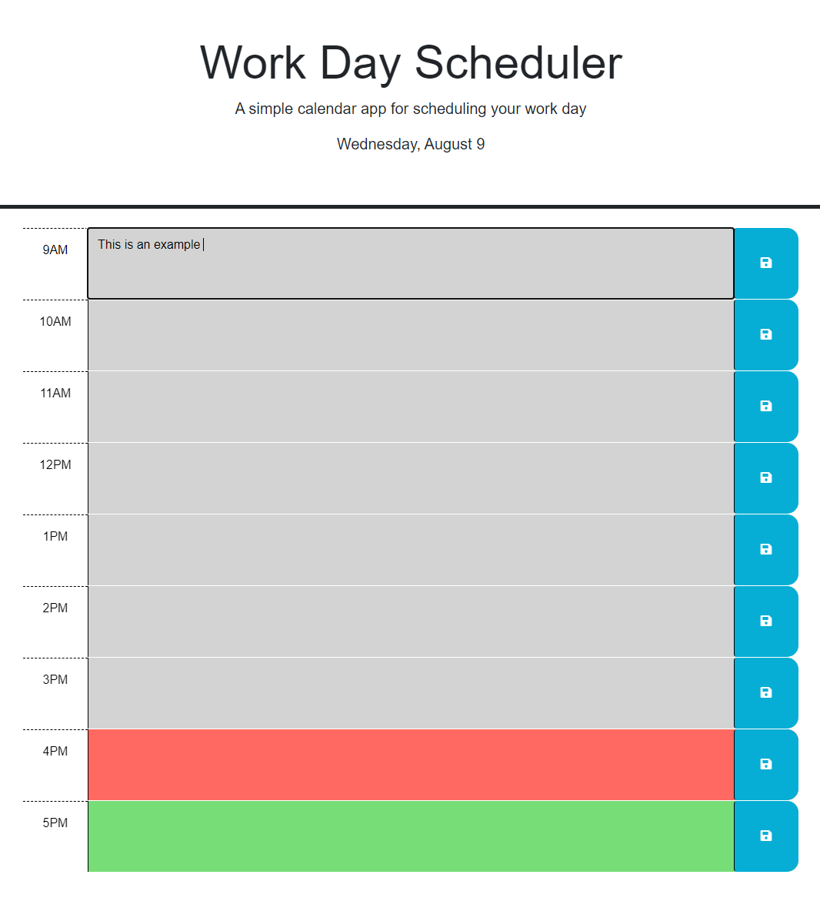
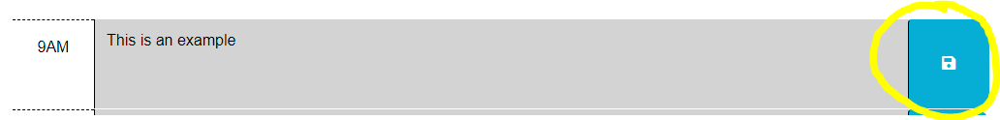

# Work Day Scheduler Starter Code

## Description
A calendar application that allows a user to save events for each hour of a typical working day (9am–5pm). This app will run in the browser and feature dynamically updated HTML and CSS powered by jQuery.

## Table of Contents 

- [Installation](#installation)
- [Usage](#usage)
- [Credits](#credits)
- [License](#license)

## Installation

You can access this project by clicking the following link: https://therealmi.github.io/WorkdayScheduler/

## Usage
Use the text boxes to enter daily activities

Save the text to the scheduler using the save buttons

## Credits

[Coding Bootcamp](https://courses.bootcampspot.com)

[Professor Phil Loy](https://github.com/philliploy)

[w3 Schools](https://www.w3schools.com/)

[Bootstrap Documentation](https://getbootstrap.com/docs/5.3/getting-started/introduction/)

## License

Please refer to the license on the repo